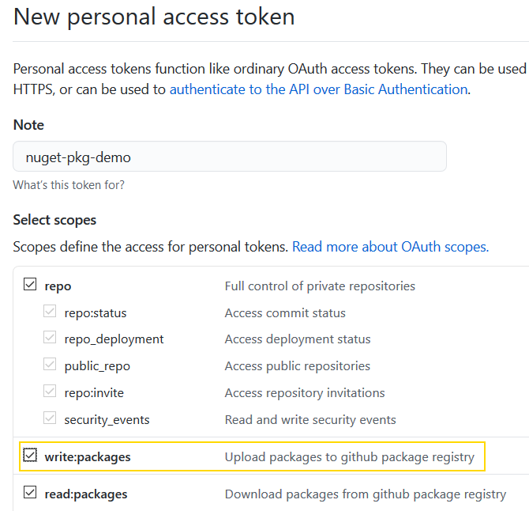
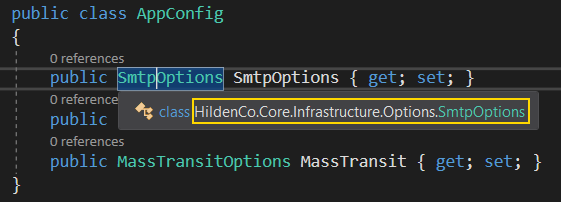

# [Hosting NuGet packages on GitHub](https://blog.hildenco.com/2020/07/hosting-nuget-packages-on-github.html)

Build, host, and consume our own NuGet packages using `GitHub Packages`

## Creating our package using the CLI

CLI allows automating package creation on continuous integration, integrating w/ APIs, webhooks, and even creating end-to-end DevOps workflows.

```
dotnet pack --configuration Release
```

This time, we should see this as output:

```
Microsoft (R) Build Engine version 16.6.0+5ff7b0c9e for .NET Core
Copyright (C) Microsoft Corporation. All rights reserved.

  Determining projects to restore...
  All projects are up-to-date for restore.
  HildenCo.Core -> C:\src\nuget-pkg-demo\src\HildenCo.Core\bin\Release\netstandard2.0\HildenCo.Core.dll
  Successfully created package 'C:\src\nuget-pkg-demo\src\HildenCo.Core\bin\Release\HildenCo.Core.0.0.1.nupkg'.
```

> [!Note]
> You may have realized that we have now built our package as release. This is another immediate benefit from decoupling our builds from VS. On rare occasions should we push packages built as Debug.

## Pushing packages to GitHub

### Generating an API Key

In order to authenticate to GitHub Packages the first thing we'll need is an access token.

Open your GitHub account, go to **Settings** > **Developer Settings** > **Personal access tokens**, click **Generate new Token**, give it a name, select **write:packages** and save:



## Creating a nuget.config file

With the API key created, let's create our `nuget.config` file.

This file should contain the authentication for the package to be pushed to the remote repo.

A base config is listed below with the fields to be replaced in bold:

```cofig
<?xml version="1.0" encoding="utf-8"?>
<configuration>
    <packageSources>
        <clear />
        <add key="github" value="https://nuget.pkg.github.com/**<your-github-username>**/index.json" />
    </packageSources>
    <packageSourceCredentials>
        <github>
            <add key="Username" value="**<your-github-username>**" />
            <add key="ClearTextPassword" value="**<your-api-key>**" />
        </github>
    </packageSourceCredentials>
</configuration>
```

## Pushing a package to GitHub

W/ the correct configuration in place, we can push our package to GitHub w/:

```
dotnet nuget push ./bin/Release/TicTacToe.1.0.0.nupkg --source "github"
```

This is what happened when I pushed mine:

```
dotnet nuget push ./bin/Release/HildenCo.Core.0.0.1.nupkg --source "github"
Pushing HildenCo.Core.0.0.1.nupkg to 'https://nuget.pkg.github.com/hd9'...
  PUT https://nuget.pkg.github.com/hd9/
  OK https://nuget.pkg.github.com/hd9/ 1927ms
Your package was pushed.
```

> [!Note]
> Didn't work? Check if you added RepositoryUrl to your project's metadata as nuget uses it  need it to push to GitHub.

## Using our Package

To complete the demo let's create an ASP.NET project to use our own package:

```
dotnet new mvc -o TestNugetPkg
```

To add a reference to your package, we'll use our own nuget.config since it contains pointers to our own repo.

If your project has a solution, copy the `nuget.config` to the solution folder. Else, leave it in the project's folder.

Open your project with Visual Studio and open the Manage NuGet Packages. You should see your newly created package there.

Select it and install.

Review the logs to make sure no errors happened:

```
Restoring packages for C:\src\TestNugetPkg\TestNugetPkg.csproj...
  GET https://nuget.pkg.github.com/hd9/download/hildenco.core/index.json
  OK https://nuget.pkg.github.com/hd9/download/hildenco.core/index.json 864ms
  GET https://nuget.pkg.github.com/hd9/download/hildenco.core/0.0.1/hildenco.core.0.0.1.nupkg
  OK https://nuget.pkg.github.com/hd9/download/hildenco.core/0.0.1/hildenco.core.0.0.1.nupkg 517ms
Installing HildenCo.Core 0.0.1.
Installing NuGet package HildenCo.Core 0.0.1.
Committing restore...
Writing assets file to disk. Path: C:\src\TestNugetPkg\obj\project.assets.json
Successfully installed 'HildenCo.Core 0.0.1' to TestNugetPkg
Executing nuget actions took 960 ms
Time Elapsed: 00:00:02.6332352
========== Finished ==========

Time Elapsed: 00:00:00.0141177
========== Finished ==========
```

And finally we can use it from our second project and harvest the benefits of clean code and code reuse:



## Final Thoughts

On this post we reviewed how to build our own NuGet packages using .NET Core's CLI, pushed them to GitHub and finally described how to consume them from our own .NET projects.

Creating and hosting our own NuGet packages is important for multiple reasons including sharing code between projects and creating deployable artifacts.
